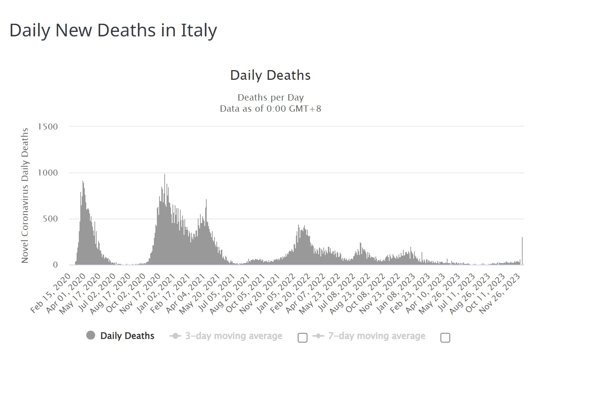
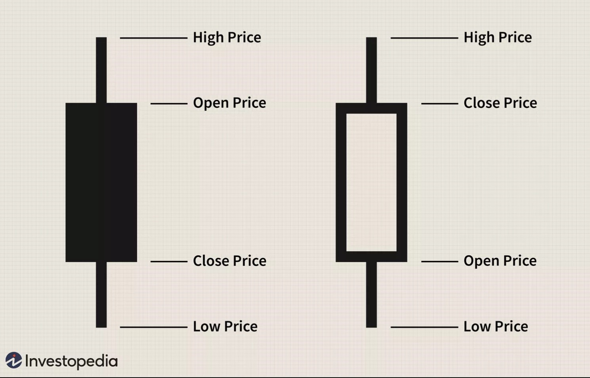

# Financial Analysis with Python: A Comprehensive Tutorial

### Sara Mezuri

## Introduction

Python holds immense importance in the financial world due to its versatility, efficiency, and extensive ecosystem of libraries. Its readability and ease of integration make it a preferred language for rapidly developing and deploying sophisticated financial models, contributing significantly to the finance industry.
NumPy, Pandas, and Matplotlib play pivotal roles in the field of financial analysis by providing powerful tools for data manipulation, analysis, and visualization. 
NumPy's array-based computations help with numerical operations and assist in the implementation of complex financial models.
Pandas, because of its DataFrame structure, help simplify data manipulation and cleaning and transform financial datasets.
Matplotlib, as a plotting library, enables the creation of clear and insightful visualizations, essential for interpreting complex financial trends and patterns.

The primary goal of this project is to explore the world of financial analysis using Python, focusing on key libraries such as NumPy, Pandas and Matplotlib. The outcome of this project is to create a tutorial on the process of analyzing financial data and visualizing the result as well. 

## Background

For this project, my focus is on conducting a comprehensive analysis of the impact of COVID-19 on the European Stock Market. 
To achieve this, I will perform a thorough financial analysis of various stock indexes across Europe, more precisely: 

* EURO STOXX 50 (The index holds stocks from eight eurozone countries: Belgium, Finland, France, Germany, Ireland, Italy, the Netherlands, and Spain.)
* FTSE 100 (The FTSE 100 Index is a index of the 100 most highly capitalized companies traded on the London Stock Exchange.)
* DAX (The DAX is stock market index consisting of the 40 major German companies trading on the Frankfurt Stock Exchange.)
* CAC40 (The CAC 40 is the index of the largest 40 companies listed in France)
* FTSE MIB (The Index consists of the 40 stocks listed on the Milano Borsa Italiana.)
* SMI (The index SMI is the most important stock index in Switzerland and comprises the 20 largest stocks.) 
* IBEX 35 (The IBEX 35 is the official index of the Spanish Continuous Exchange, comprised of the 35 most liquid stocks.)

I plan to collect historical stock data from 2017 to 2022, aiming to recognize patterns and trends. Through a detailed analysis, I aim to extract valuable insights that can shed light on the impact of COVID-19 on the European Stock Market, providing a comprehensive understanding of the market dynamics during this period.

## Outline

* Importing the data
    - installing yfinance library
    - creating a dataframe
* Exploratory Data Analysis
* Data Visualization    
    - Missing Values Visualization
    - Line Charts
    - Candlestick Charts
* Financial Analysis 
    - Daily Returns
    - Average Daily Returns 
    - Volatility

## Importing the data

To import stock data, we will use a Python library called `yfinance`, which provides a convenient way for pulling different financial data from various online sources such as Yahoo Finance, and putting all these data into a Pandas DataFrame. Then we will select the stocks (or tickers) that we want to analyze.  
To find the stocks we are interested in, we go to Yahoo Finance [https://uk.finance.yahoo.com] and search each stock as shown below: 

The highlighted name is the ticker for each stock index. 

Next, we to import all these stock index tickers using `yfinance`, and then we create a data frame containing all of them.  

## Exploratory Data Analysis
Now let's look at this data frame and get an idea of what our data looks like. 

To get a better understanding of our data frame, we look at its shape, structure, and descriptive statistics. 

## Data Visualization

**Data visualization** is important to comprehend large datasets, and its significance lies in its ability to make complex information more accessible and understandable through charts and graphs. 

Also, visualization helps in identifying patterns, trends, and relationships within the data that might not be immediately apparent in tabular form. It also helps in identifying data quality issues such as missing values, outliers, or inconsistencies. 

Python's data visualization advantages come from its useful libraries like Matplotlib, Seaborn, and Plotly. These tools work well with other data tools, let you customize your charts, and even create interactive ones.

### Missing Values Visualization

Now, referring to the results we got above, we might have some missing data in our data frame. We can check this by using a Python library called `missingno`. 

As we can see, we do not have many data missing, so we are good to go. 

If you want to get a better view of the missing data for each stock index, then create a data frame for each of them and then use `missingno` again. For example, let's see what the missing data looks like for the **Milano Italia Borsa (FTSE MIB)**: 

### Line Charts

Continuing forward, our next objective is to generate some line charts that show the movement of our data over time. This aims to explore potential trends or shifts in price movements. 

We can use the previously generated data frames containing adjusted closing prices to create individual plots. 

Another way to do this can be by using `Matplotlib`, as below:

These line charts are quite effective for identifying trends or irregularities.

For example, we observe a substantial decline in prices across all stock indices during the March 2020 timeframe. This corresponds to the period when the COVID-19 pandemic had a significant impact on the global economy, leading to a widespread sell-off of stocks.

Furthermore, it is evident from the chart that the Milano Italia Borsa index experienced a more significant decrease. Considering the context of the COVID-19 crisis in Italy during that period, it aligns with the observation that the Italian economy was among the most affected in Europe. 

The attached graph illustrates the peak in daily deaths around March-April 2020 in Italy, providing additional context to the situation. 

The data source for this information is available on the linked website.

https://www.worldometers.info/coronavirus/country/italy/

### Candlestick Charts

Another visualization tool is the candlestick chart.

Candlestick charts are a type of financial chart used to represent the price movements of stocks, over a specific time period. They provide a visual representation of price fluctuations and are useful in identifying trends, and potential future price movements. Each "candlestick" on the chart represents the open, close, high, and low prices for a given time interval, typically a day.

The candlestick has two main components:

Body: The rectangular area between the open and close prices. If the close price is higher than the open price, the body is often filled or colored. If the close price is lower, the body may be empty or a different color.

Wicks or Shadows: The thin lines, called wicks or shadows, extend from the top and bottom of the body and represent the high and low prices during the time period.

Candlestick charts are so popular in financial analysis because they provide a comprehensive and visual way to interpret price action in financial markets. There are different patterns that candlestick charts display, which help in analyzing the market trends, but I will not talk about them in detail. 

The picture above can be found at https://www.investopedia.com/trading/candlestick-charting-what-is-it/

Now, let's create candlestick charts for our stock indices.

When the closing price surpasses the opening price, the candlestick is depicted in green. Otherwise, if the price declines throughout the day, the candlestick appears in red. A brief observation of the candlestick lengths reveals that 2020 marked a period when prices consistently declined.

## Financial Analysis 

### Return Analysis

Return analysis of the stock market includes the evaluation and examination of the performance of an investment by assessing the returns it generates over a specific period. 

This analysis includes calculating absolute and annualized returns, comparing performance against indices, assessing risk-adjusted returns through ratios like the Sharpe and Treynor ratios, and considering factors like dividend yield. 

Additionally, return analysis provides insights into the consistency of the performance of the market in general, and by analyzing returns, we try to get a better idea of the success of the investments. 

Now, let's calculate the return of our stock indices for each closing price. For this, we can use `.pct_change()` function is a method provided by pandas, a popular data manipulation library in Python. This function is specifically used with time series data, such as stock prices or other sequential data, and it calculates the percentage change between the current and a prior element in the series.

By using the data frame, we can see how much we gain or loss the first week of March 2020. The positive values represent gains and the negative values represent losses. 

For example, FTSE MIB gained 0.43 % on March 3rd and 0.91% on March 4th, but lost 1.78% on the 5th and 3.502% on the 6th, resulting in a loss overall. 

To get a better understanding, we can use Average Daily Returns.The average returns is the expected value of an investment’s change over time. To calculate the average daily return, we use the formula: 

**ADR = Sum of Daily Returns / Number of Trading Days**.

We can calculate the ADR in Python simply by using the `.mean()` function. 

The above results are the average daily returns over 5 years. In other words, it seems that the value of the stock market in Italy has increased by 0.022% each day.

While, IBEX, the stock index for the Spanish market seems to have decreased by 0.0017% daily, indicating that the Spanish economy was struggling even before Covid, and Covid impacted it even more.

Another way to analyze our data would be by calculating the **Best** and the **Worst** day returns. For this, we simply need to find what is the minimum and the maximum return for each stock index. 

It is not a surprise that the Worst Day Returns are during March 2020 (the peak of pandemic). 

The plot of the returns seems to be quite messy. So let's create some subplots. To do so, Plotly's `make_subplots` function comes in handy.

The code below creates a subplot for each stock, arranging them vertically. The `make_subplots` function is used to create a subplot grid, and each stock's returns are plotted in a separate subplot. 

We can also plot the distribution plot of each stock index as shown below: 

From these charts, it is evident that the lowest returns occurred in March 2020, demonstrating again substantial impact of the pandemic on the market. Once again, the data highlights the profound influence of global events on financial markets, with March 2020 reflecting a period of particularly diminished returns. 

And lastly, let's look at the **Volatility** of these stock index.

Volatility refers to the degree of variation or fluctuation in the price of a stock. It is a statistical measure that quantifies the dispersion of returns for a given security or market index.

High volatility implies that the price of the asset can change dramatically in a short period, while low volatility suggests more stable and gradual price movements. We are interested in the **Historical Volatility**, which measures how much the price of an asset has deviated from its average price over a specific period in the past. Historical volatility is often calculated as the standard deviation of the daily returns.

It seems like the SSMI has the lowest standard deviation, suggesting that the Swiss market might have been the most stable and safe market. 

## Conclusions

In conclusion, this comprehensive tutorial has provided a foundational understanding of a simple financial analysis using Python, offering a step-by-step guide to leveraging powerful libraries such as yfinance, pandas, and Plotly. 

We started by fetching historical stock data for a diverse set of European indices, examining the impact of major events like the COVID-19 pandemic on stock markets. 

We explored key financial metrics, including stock prices, returns, and daily volatility, to uncover trends and anomalies. 

The tutorial also demonstrated how to create insightful visualizations, such as candlestick charts and line plots, to enhance data interpretation. 

Additionally, we conducted a return analysis, calculated average daily returns and volatility. By employing practical examples and hands-on coding exercises, this tutorial equips you with the essential tools and skills to conduct a simple financial analysis, helping you to get some information regarding different investments.

